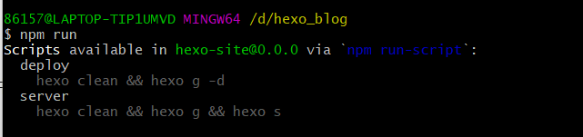

### 1、创建一个md文件

md文件即为Markdowm文件，通过以下命令创建：

```
$ hexo new <title>
```

eg.

```
$ hexo new "如何写博客"
```

把_config.yml中的post_asset_folder设为true，这个配置的意思是每次new post一个博客，会增加一个和博客同名的文件夹；若为false则只生成.md

这样执行hexo new <title>将在D:\\<blog>\source\_posts\_posts下创建一个同名文件夹及.md

### 2、布局（layout）

- 创建md文件时，我们可以指定布局

```
$ hexo new [layout] <title>
```

eg.

```
$ hexo new page "我的页面"
```


- 布局有三种：`post`（文章）、`draft`（草稿）、`page`（页面）

在新建文件时，Hexo 会根据 `scaffolds` 文件夹内相对应的文件（可以理解为模板）来建立md文件：


- 如果没有指定布局类型，则为默认布局`post`，可以在站点配置文件修改 `default_layout` 参数来修改默认布局。
- 当我们创建不同布局的md文件时，它们会存储在不同路径：


> 对于独立页面来说，Hexo 会创建一个以标题为名字的目录，并在目录中放置一个 `index.md` 文件，页面布局顾名思义就是用来DIY我们博客页面的。

### 3、草稿（draft）

`draft`这种布局在建立时会被保存到 `source/_drafts` 文件夹中，但不会显示在页面上，如果我们不想某一篇文章显示在页面上，那么就可以把它移动到`_drafts`文件夹中。

- 我们可在启动服务器时加上 `--draft` 参数来查看草稿。

```
$ hexo server --draft
```

- 还可以在站点配置文件中把 `render_drafts` 参数设为 `true` 来预览草稿。
- 我们可以通过 `publish` 命令将草稿发布文章或者页面，它将会被移动到指定的文件夹。

```
$ hexo publish [layout] <title>
```

### 4、Front-matter

当我们创建一个md文件后，打开后会看到一些内容，这些称为`Front-matter`，它是文件最上方以 `---` 分隔的区域，用于指定个别文件的变量，举例来说：

```yaml
---
title: Hello World # 标题就是我们上面创建的时候指定的名字
date: 2013/7/13 20:46:25 # 文件创建的时间
---
```

> 在`Typora`中我们在md文件的首行（必须是第一行）输入`---` ，然后按回车就可以插入`Front-matter`了。

Front-matter预定义参数

```text
  layout  布局  默认为true，如果你不想你的文章被处理，可以设置为false
  title  标题  标题会显示在最上方居中位置     
  date  建立日期    如果不指定则为默认值-文件创建日期，可以自定义。
  update  更新日期  如果不指定则为默认值-文件修改后重新生成静态文件的日期。
  comments  是否开启文章的评论功能 默认值为true
  tags  标签（不适用于页面page布局）
  categoreies  分类（不适用于页面page布局）
  permalink  覆盖文章网址
  keywords  仅用于 meta 标签和 Open Graph 的关键词（不推荐使用）
```

### 为文章添加分类与标签

只有文章（post布局）支持分类和标签，需要在`Front-matter`中设置。分类有层级关系，标签没有。

举个例子：
1）下面文章它的标签是：Hexo、博客
2）分类是： 个人博客 > Hexo博客
3）“Hexo博客” 是 “个人博客” 的子分类

```yaml
categories:
- 个人博客（第一层级）
- Hexo博客（第二层级）
tags:
- Hexo
- 博客
```

### 为文章添加多个分类

1）下面文章属于三个分类：日常 > 生活，日常 > 随想，日记
2）其中生活、随想为日常的子分类，日常和日记为同级分类

```yaml
categories:
- [日常, 生活]
- [日常, 随想]
- [日记]
```

### 5、typora快捷键

标题：Ctrl+1、2、3...对应一、二、三...级标题（光标定位到需要设置为标题的行，按快捷键）

加粗：Ctrl+B（选中要加粗的文本，按快捷键）

斜体：Ctrl+I（选中要设置斜体的文本，按快捷键）

下划线：Ctrl+U（选中要加下划线的文本，按快捷键）

删除线：Alt+Shift+5（选中要加删除线的文本，按快捷键）

代码片段：Ctrl+Shift+`（选中要设置为代码片段的文本，按快捷键）

代码块：Ctrl+Shift+K（任意位置按快捷键，选择编程语言然后在代码块中输入代码）

切换到下一行：Ctrl+Enter（任意位置按快捷键，在代码块中可以跳出代码块另起一行）

链接：Ctrl+K（先复制链接，然后选中要加链接的文本，按快捷键。Ctrl+左键点击文本可跳转到对应链接）

取消格式：再次按相同的快捷键即可

有序列表：数字+点+空格

任务列表：加号或减号+空格

切换到列表下一行：Space+Enter

嵌套列表：按Tab键

退出列表：按 Shift+Tab

插入表格：Ctrl+T

引用：输入>后面加空格，或者Ctrl+Shift+Q

### 6、插入图片

#### 1.从网页资源粘贴

Typora自动输入常规markdown语法``

如果出现403报错

在文章头部加上<meta name="referrer" content="no-referrer" />


#### 2.从本地引用

- 安装一个图片路径转换的插件

```
npm install https://github.com/7ym0n/hexo-asset-image --save
```

（这是个修改过的插件，经测试无问题），使用这个插件来引入图片，而不是网上那些方法里说的用传统md语法相对路径的方法。

- 将需要引用的本地图片存放在与文章名相同的文件夹中（即hexo new <博客名>时生成的文件夹）

- 在需要插入图片的地方写下``

```

```

### 7、常用命令

- **清除缓存：**`hexo clean`
- **生成静态文件：**`hexo generate`可简写为 `hexo g`
- **启动服务器：**`hexo server`或者 `hexo s` 常用参数：`-p（--port）`重设端口
- **部署：**`hexo deploy`可简写为`hexo d`，用于将网站部署到服务器上。（暂时用不到，目前都是在本地，后面我们将博客托管到`GitHub Pages`或`Gitee Pages`时才会用到此命令）
  常用参数：`-g（--generate）`，`hexo d -g`部署前预先生成静态文件，等同于 `hexo g -d`

**一般发布文章或者修改博客后需要这些操作：**清除缓存>生成静态文件>启动服务器，测试没问题后再部署。

```csharp
// 我们可以写成一条命令
$ hexo clean && hexo g && hexo s
$ hexo d
```

#### 自定义命令

npm 可以在项目*package.json*里面自定义脚本命令

```json
"scripts": {

  "deploy": "hexo clean && hexo g -d ",
  "server": "hexo clean && hexo g && hexo s"
},
```

执行npm run可以查看script的list





在写完一篇博客我们可以先启动本地服务器来检查效果

```
$ npm run server
```

确认没问题后，部署到服务器命令为

```
$ npm run deploy
```


#### 执行顺序

一个npm脚本可以执行多个任务，这些任务之间可以指定不同的执行顺序。

```
'&' 并行执行顺序，同时执行
"dev":"node test.js & webpack"

'&&'继发顺序，执行前面之后才可以执行后面
"dev":"node test.js && webpack"
```


### 参考博客

```
https://www.cnblogs.com/congcong1/p/10588151.html
https://zhuanlan.zhihu.com/p/156915260
```

